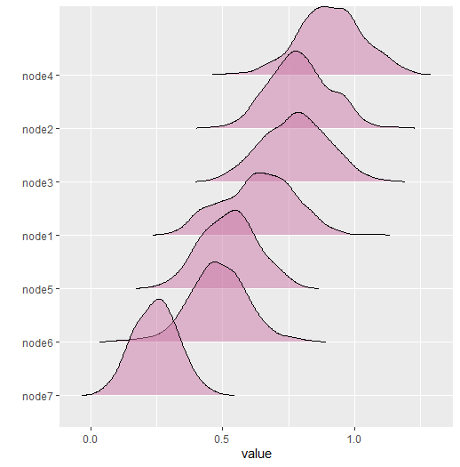
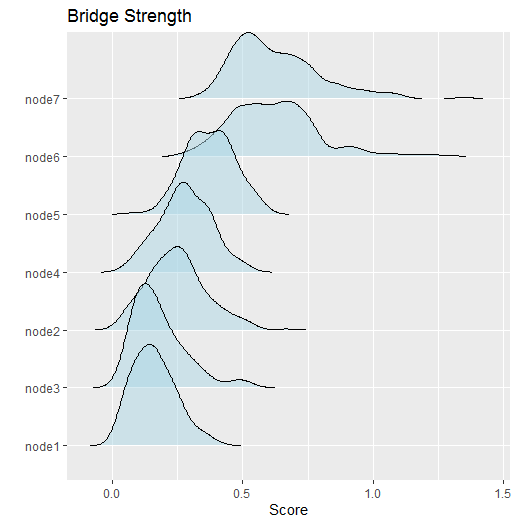
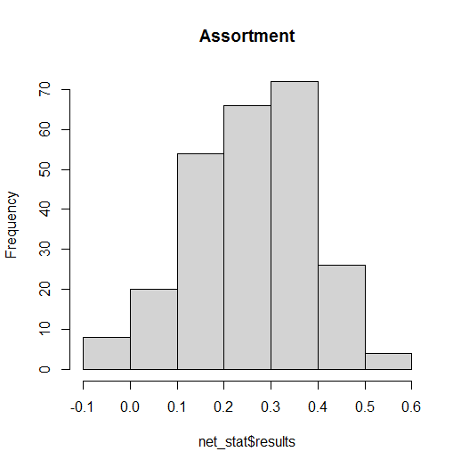

# Custom Network Statistics

## Background

This vignette describes a new feature to **BGGM** (`2.0.0`) that allows
for computing custom network statistics (e.g., centrality). The new
function is called `roll_your_own` and it was suggested by a user of
**BGGM** ([see feature request
here](https://github.com/donaldRwilliams/BGGM/issues/12)).

## Basic Idea

The basic idea is to compute the chosen network statistic for each of
the sampled partial correlation matrices, resulting in a distribution.
All that is required is to define a function that takes either a partial
correlation matrix or a weighted adjacency matrix (the partial
correlation matrix with values set to zero) as the first argument.
Several examples are provided below.

#### R packages

``` r

# need the developmental version
if (!requireNamespace("remotes")) { 
  install.packages("remotes")   
}   

# install from github
remotes::install_github("donaldRwilliams/BGGM")
```

#### Data

In all examples, a subset of `ptsd` data is used. The subset includes
two of the “communities” of symptoms (details for these data can be
found in Armour et al. 2017). The data are ordinal (5-level Likert).

``` r

# need these packages
library(BGGM)
library(ggplot2)
library(assortnet)
library(networktools)

# data
Y <- ptsd[,1:7]
```

#### Fit Model

For these data, the GGM is estimated with a semi-parametric copula (Hoff
2007). In **BGGM**, this implemented with `type = mixed` which is kind
of a misnomer because the data do not have to be “mixed” (consisting of
continuous and discrete variables). Note that the model is fitted only
once which highlights that only the posterior samples are needed to
compute any network statistic.

``` r

library(BGGM)

# copula ggm
fit <- estimate(Y, type = "mixed", iter = 1000)
```

## Examples

### Expected Influence

The first example computes expected influence (Robinaugh et al. 2016).
The first step is to define a function

``` r

# define function
f <- function(x,...){
  networktools::expectedInf(x,...)$step1
}
```

Note that `x` takes the matrix which is then passed to `expectedInf`.
The `...` allows for passing additional arguments to the `expectedInf`
function. An example is provided below. With the function defined, the
next step is to compute the network statistic.

``` r

# iter = 250 for demonstrative purposes
# (but note even 1000 iters takes less than 1 second)
# compute
net_stat <- roll_your_own(object = fit,
                          FUN = f,
                          select = FALSE,
                          iter = 250)
# print
net_stat

#> BGGM: Bayesian Gaussian Graphical Models 
#> --- 
#> Network Stats: Roll Your Own
#> Posterior Samples: 250 
#> --- 
#> Estimates: 
#> 
#>  Node Post.mean Post.sd Cred.lb Cred.ub
#>     1     0.701   0.099   0.508   0.871
#>     2     0.912   0.113   0.722   1.179
#>     3     0.985   0.112   0.742   1.199
#>     4     1.056   0.105   0.851   1.247
#>     5     1.056   0.116   0.862   1.288
#>     6     0.491   0.092   0.329   0.679
#>     7     0.698   0.098   0.521   0.878
#> --- 
```

The option `select = FALSE` indicates to compute the statistics from the
partial correlation matrices (nothing set to zero). This can be changed
with `select = TRUE`. Internally, each of the sampled partial
correlation matrices is multiplied by the adjacency matrix.

``` r

net_stat <- roll_your_own(object = fit,
                          FUN = f,
                          select = TRUE,
                          iter = 250)

# print
net_stat

#> BGGM: Bayesian Gaussian Graphical Models 
#> --- 
#> Network Stats: Roll Your Own
#> Posterior Samples: 250 
#> --- 
#> Estimates: 
#> 
#>  Node Post.mean Post.sd Cred.lb Cred.ub
#>     1     0.636   0.136   0.386   0.874
#>     2     0.792   0.113   0.580   0.996
#>     3     0.777   0.122   0.544   1.001
#>     4     0.910   0.121   0.667   1.143
#>     5     0.525   0.104   0.331   0.727
#>     6     0.484   0.110   0.270   0.686
#>     7     0.247   0.081   0.088   0.412
#> --- 
```

The results are then plotted with

``` r

plot(net_stat)
```



### Bridge Strength

The next example computes bridge strength (Jones et al. 2019). This
requires the user to define clusters or “communities”.

``` r

# clusters
communities <- substring(colnames(Y), 1, 1)

# function is slow
f <- function(x, ...){
networktools::bridge(x, ...)$`Bridge Strength`
}


# compute
net_stat <- roll_your_own(object = fit,
                          FUN = f, 
                          communities = communities,
                          iter = 250)

# print
net_stat

#> BGGM: Bayesian Gaussian Graphical Models 
#> --- 
#> Network Stats: Roll Your Own
#> Posterior Samples: 250 
#> --- 
#> Estimates: 
#> 
#>  Node Post.mean Post.sd Cred.lb Cred.ub
#>     1     0.162   0.082   0.035   0.347
#>     2     0.250   0.113   0.061   0.501
#>     3     0.180   0.104   0.049   0.480
#>     4     0.280   0.098   0.090   0.480
#>     5     0.375   0.093   0.196   0.558
#>     6     0.617   0.166   0.339   1.002
#>     7     0.628   0.166   0.400   1.025
#> --- 
```

Notice `communities`. This is passed to `...` in the function `f`,
which, in turn, is passed to the function `bridge`. Any number of
arguments can be passed this way. Here are the results

This can then be plotted and further customized (the returned object is
a `ggplot`)

``` r

plot(net_stat, 
     fill = "lightblue") + 
  ggtitle("Bridge Strength") + 
  xlab("Score")
```



### Assortment

The next example computes assortment (Newman 2003).

``` r

# clusters
communities <- substring(colnames(Y), 1, 1)

# define function
f <- function(x,...){
  assortnet::assortment.discrete(x, ...)$r
}

net_stat <- roll_your_own(object = fit,
                          FUN = f,
                          types = communities,
                          weighted = TRUE,
                          SE = FALSE, M = 1, 
                          iter = 250)

# print
net_stat

#> BGGM: Bayesian Gaussian Graphical Models 
#> --- 
#> Network Stats: Roll Your Own
#> Posterior Samples: 250 
#> --- 
#> Estimates: 
#> 
#>  Post.mean Post.sd Cred.lb Cred.ub
#>      0.261   0.124   -0.01   0.469
#> --- 
```

This example demonstrate that `...` can take several arguments. The
results are stored in the `net_stat` object. They can be accessed with

``` r

hist(net_stat$results, main = "Assortment")
```



## Note

The function `roll_your_own` is expecting the custom function to return
either a single number or a number for each node. This ensures all the
printing and plotting functions work. However, you could return anything
you want and then access the results to plot, summarize, etc.

## References

Armour, Cherie, Eiko I Fried, Marie K Deserno, Jack Tsai, and Robert H
Pietrzak. 2017. “A Network Analysis of DSM-5 Posttraumatic Stress
Disorder Symptoms and Correlates in US Military Veterans.” *Journal of
Anxiety Disorders* 45: 49–59. <https://doi.org/10.31234/osf.io/p69m7>.

Hoff, Peter D. 2007. “Extending the Rank Likelihood for Semiparametric
Copula Estimation.” *The Annals of Applied Statistics* 1 (1): 265–83.
<https://doi.org/10.1214/07-AOAS107>.

Jones, Payton J, Ruofan Ma, and Richard J McNally. 2019. “Bridge
Centrality: A Network Approach to Understanding Comorbidity.”
*Multivariate Behavioral Research*, 1–15.

Newman, Mark EJ. 2003. “Mixing Patterns in Networks.” *Physical Review
E* 67 (2): 026126.

Robinaugh, Donald J, Alexander J Millner, and Richard J McNally. 2016.
“Identifying Highly Influential Nodes in the Complicated Grief Network.”
*Journal of Abnormal Psychology* 125 (6): 747.
