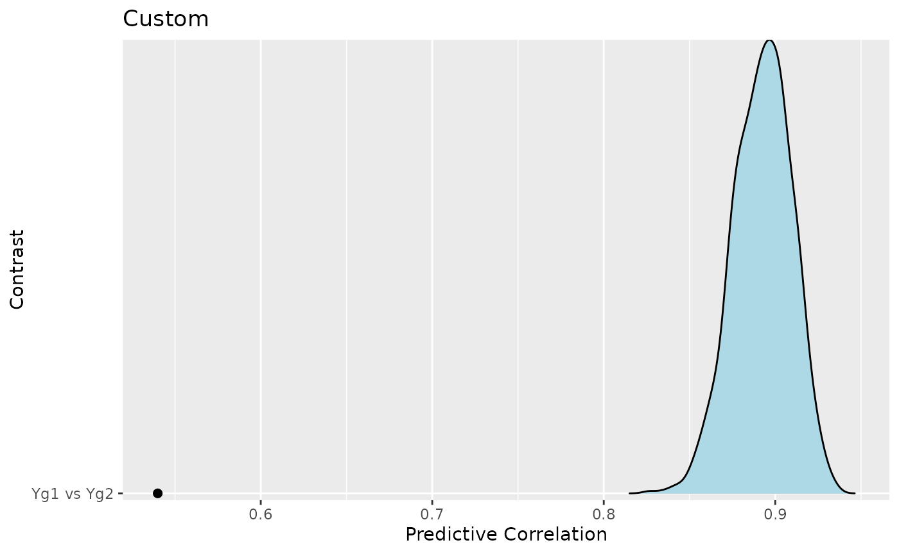
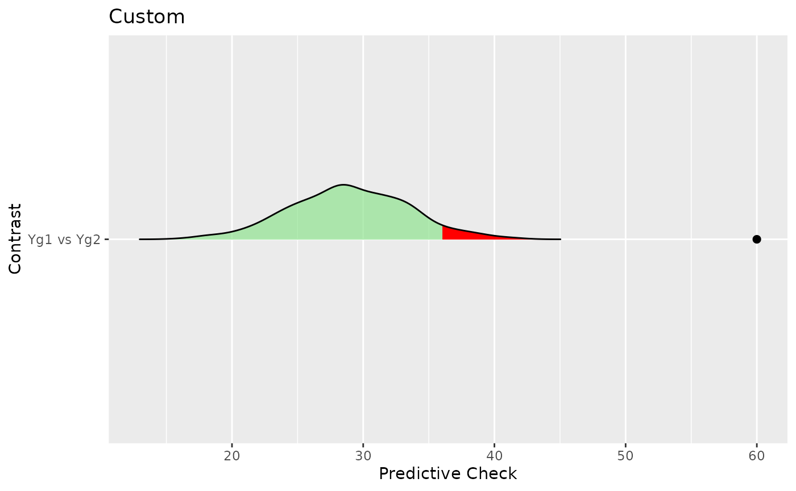
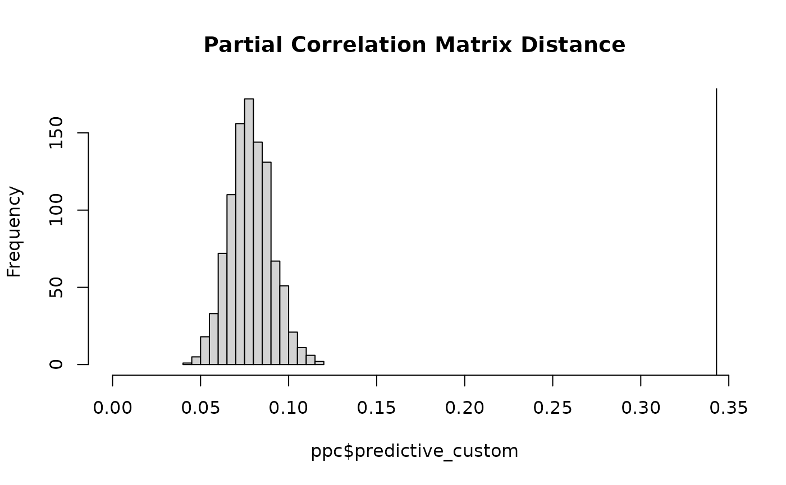
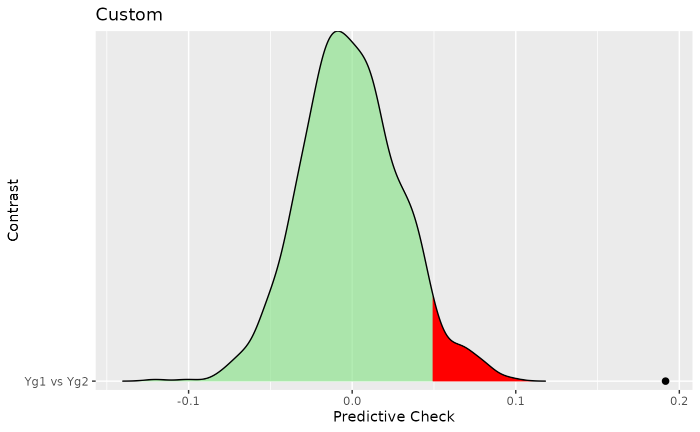
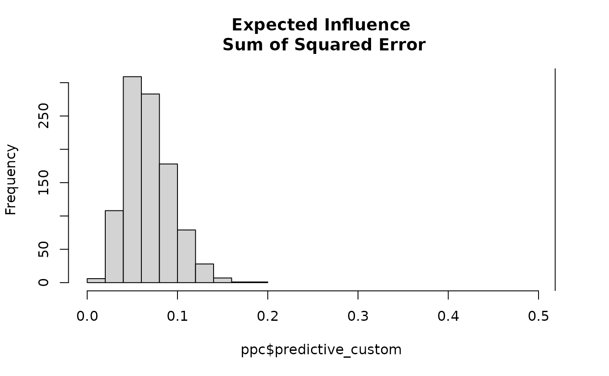

# Custom Network Comparisons

## Background

It is quite common to have partial correlation networks (GGMs) for
various subgroups, say, males and females, a control and treatment
group, or perhaps several educational levels. In this case, it is
important to not only determine whether the groups are different, but
actually compare the groups in a way that answers a specific question of
interest.

To date, most `R` packages provide a few ways to compare groups,
including **BGGM** (version `1.0.0`). In version `2.0.0`, however,
**BGGM** includes a new feature for the function `ggm_compare_ppc` that
enables users to **compare networks in any way they want**.

## Basic Idea

The technical details of the approach are described in (Williams et al.
2020). The basic idea is to

1.  Draw samples from the posterior distribution, assuming the groups
    are equal (i.e., the “null” model).

2.  Generate the posterior **predictive** distribution for the chosen
    test-statistic (how the groups are being compared)

    - This can be understood as what we would expect to observe in the
      future (e.g., in replication), assuming the groups were in fact
      equal.

3.  Compute the test-statistic for the observed groups.

4.  Then compare the observed test-statistic to the predictive
    distribution (what is expected under the “null” model).

    - If the observed error is larger than the model assuming group
      equality, this suggests that the groups are different.

In **BGGM**, the default is to compare the groups with respect to
(symmetric) Kullback-Leibler divergence (i.e., “distance” between
multivariate normal distributions) and the sum of squared error (for the
partial correlation matrix). This was shown to be quite powerful in
Williams et al. (2020), while also having a low false positive rate.

In the following, the focus is on defining custom functions and using
them with `ggm_compare_ppc`. In all examples, post-traumatic stress
disorder networks are compared (Fried et al. 2018).

#### R packages

``` r
# need the developmental version
if (!requireNamespace("remotes")) { 
  install.packages("remotes")   
}   

# install from github
remotes::install_github("donaldRwilliams/BGGM")
```

#### Data

Only the correlation matrices are available. Hence, multivariate normal
data is generated with that *exact* correlation structure via the `R`
package **MASS**.

``` r
# need these packages
library(BGGM)
library(ggplot2)
library(assortnet)
library(networktools)
library(MASS)

# group 1
Yg1 <- MASS::mvrnorm(n = 926, 
                     mu = rep(0, 16), 
                     Sigma = ptsd_cor3, 
                     empirical = TRUE)

# group 2
Yg2 <- MASS::mvrnorm(n = 956, 
                     mu = rep(0, 16), 
                     Sigma = ptsd_cor4, 
                     empirical = TRUE)
```

## Illustrative Examples

### Correlation

This first example looks at the correlation between partial correlations
of the two networks. Note that it could be two networks have what is
considered a large correlation. However, the question here is, assuming
the groups are equal, just how large should the correlation be? This is
needed to interpret the observed test-statistic.

#### Step 1: Define Custom Function

The first step is to define a custom function that takes two data
matrices and the output is the chosen test-statistic (in this case a
correlation)

``` r
f <- function(Yg1, Yg2){
  # number of nodes
  p <- ncol(Yg1)
  
  # index of off-diagonal
  indices <- upper.tri( diag(p))
  
  # group 1:
  # fit model
  g1_fit <- estimate(Yg1, analytic = TRUE)
  # pcors
  g1_pcors <- pcor_mat(g1_fit)[indices]
  
  # group 2
  # fit model
  g2_fit <- estimate(Yg2, analytic = TRUE)
  # pcors
  g2_pcors <- pcor_mat(g2_fit)[indices]
  
  # test-statistic
  cor(g1_pcors, g2_pcors)
  }
```

#### Step 2: Compute the Observed Score

The next step is to compute the observed test-statistic, that is, the
correlation between the partial correlations.

``` r
obs <- f(Yg1, Yg2)

# observed
obs
```

    ## [1] 0.5399268

#### Step 3: Predictive Check

With the function, `f`, and the observed scores, `obs`, in hand, what is
left is the predictive check

``` r
ppc <- BGGM::ggm_compare_ppc(Yg1, Yg2, 
                       FUN = f, 
                       custom_obs = obs, 
                       iter = 1000, 
                       loss = FALSE)
```

Note that `loss = FALSE` controls how the p-value is computed. It is an
indicator of whether the test-statistic is a “loss” (a bad thing). In
this case, a large correlation is a good thing so it is set to `FALSE`.
The results can then be printed

``` r
ppc
```

    ## BGGM: Bayesian Gaussian Graphical Models 
    ## --- 
    ## Test: Global Predictive Check 
    ## Posterior Samples: 1000 
    ##   Group 1: 926 
    ##   Group 2: 956 
    ## Nodes:  16 
    ## Relations: 120 
    ## --- 
    ## Call: 
    ## BGGM::ggm_compare_ppc(Yg1, Yg2, iter = 1000, FUN = f, custom_obs = obs, 
    ##     loss = FALSE)
    ## --- 
    ## Custom: 
    ##  
    ##    contrast custom.obs p.value
    ##  Yg1 vs Yg2       0.54       0
    ## ---

which shows the posterior predictive p-value is zero. This indicates
that the observed correlation is lower than the entire predictive
distribution (the distribution of correlations for future data, assuming
group equality)

and finally plot the results

``` r
plot(ppc)
```



The density is the predictive distribution for the correlation. Recall
that this is the correlation that we would expect, given the groups were
actually the same, and the black point is the observed correlation. In
this case, it seems quite clear that the “null model” is inadequate–the
groups are apparently quite different.

### Hamming Distance

The next example is [Hamming
distance](https://en.wikipedia.org/wiki/Hamming_distance), which, in
this case, is the squared error for the adjacency matrices. It seems
reasonable to think of this as a test for different network structures
or patterns of zeros and ones.

#### Step 1: Define Custom Function

The first step is to define a custom function that takes two data
matrices and the output is the chosen test-statistic (in this case
Hamming distance)

``` r
f <- function(Yg1, Yg2){
  # nodes
  p <- ncol(Yg1)
  
  # index of off-diagonal
  indices <- upper.tri( diag(p))

  # fit models
  fit1 <-  BGGM::estimate(Yg1, analytic = TRUE)
  fit2 <-  BGGM::estimate(Yg2, analytic = TRUE)
  
  # select graphs
  sel1 <- BGGM::select(fit1)
  sel2 <- BGGM::select(fit2)
  
  # hamming distance
  sum((sel1$adj[indices] - sel2$adj[indices]) ^ 2)
}
```

#### Step 2: Compute the Observed Score

The next step is to compute the observed test-statistic, that is, the
Hamming distance between adjacency matrices

``` r
obs <- f(Yg1, Yg2)

# observed
obs
```

    ## [1] 60

#### Step 3: Predictive Check

With the function, `f`, and the observed scores, `obs`, in hand, what is
left is the predictive check

``` r
ppc <- BGGM::ggm_compare_ppc(Yg1, Yg2, 
                       FUN = f, 
                       custom_obs = obs, 
                       iter = 1000)
```

The results can then be printed

``` r
ppc
```

    ## BGGM: Bayesian Gaussian Graphical Models 
    ## --- 
    ## Test: Global Predictive Check 
    ## Posterior Samples: 1000 
    ##   Group 1: 926 
    ##   Group 2: 956 
    ## Nodes:  16 
    ## Relations: 120 
    ## --- 
    ## Call: 
    ## BGGM::ggm_compare_ppc(Yg1, Yg2, iter = 1000, FUN = f, custom_obs = obs)
    ## --- 
    ## Custom: 
    ##  
    ##    contrast custom.obs p.value
    ##  Yg1 vs Yg2         60       0
    ## ---

And then plot the results

``` r
plot(ppc)
```

    ## $plot_custom



This result is intriguing. Whereas the correlation looked at the
relation between partial correlation, here there seems to be evidence
that the adjacency matrices are different (perhaps suggesting that the
conditional independence structure is different).

### Partial Correlation Matrix Distance

There might also be interest in the so-called correlation matrix
distance (Herdin et al. 2005). This is also easily tested, in this case
for the partial correlation matrix.

#### Step 1: Define Custom Function

``` r
f <- function(Yg1, Yg2){
  # nodes
  p <- ncol(Yg1)
  
  # index of off-diagonal
  indices <- upper.tri( diag(p))

  # fit models
  fit1 <-  BGGM::estimate(Yg1, analytic = TRUE)
  fit2 <-  BGGM::estimate(Yg2, analytic = TRUE)
  
  pcor1 <- BGGM::pcor_mat(fit1) 
  pcor2 <- BGGM::pcor_mat(fit2)
  
  # CDM for partial correlations
  # note: numerator is the trace; denominator is the Frobenius norm
  1 - (sum(diag(pcor1 %*% pcor2)) / (norm(pcor1, type = "f") * norm(pcor2, type = "f")))
}
```

#### Step 2: Compute the Observed Score

The next step is to compute the observed test-statistic, that is, the
Partial Correlation Matrix Distance

``` r
obs <- f(Yg1, Yg2)

# observed
obs
```

    ## [1] 0.3430489

#### Step 3: Predictive Check

With the function, `f`, and the observed scores, `obs`, in hand, what is
left is the predictive check

``` r
ppc <- BGGM::ggm_compare_ppc(Yg1, Yg2, 
                       FUN = f, 
                       custom_obs = obs, 
                       iter = 1000)
```

The results can then be printed

``` r
ppc
```

    ## BGGM: Bayesian Gaussian Graphical Models 
    ## --- 
    ## Test: Global Predictive Check 
    ## Posterior Samples: 1000 
    ##   Group 1: 926 
    ##   Group 2: 956 
    ## Nodes:  16 
    ## Relations: 120 
    ## --- 
    ## Call: 
    ## BGGM::ggm_compare_ppc(Yg1, Yg2, iter = 1000, FUN = f, custom_obs = obs)
    ## --- 
    ## Custom: 
    ##  
    ##    contrast custom.obs p.value
    ##  Yg1 vs Yg2      0.343       0
    ## ---

which again provides a p-value of zero.

Note that the object `ppc` includes the predictive samples that allows
for user defined plots (in the event something custom is desired).

``` r
hist(ppc$predictive_custom, 
     xlim = c(0, obs), 
     main = "Partial Correlation Matrix Distance")
abline(v = obs)
```



Note that the line is the observed which again makes it clear that the
distance is quite surprising, assuming the null model were true.

### Assortment

This next example is assortment (Newman 2003), which is a measure
related to clustering in a network. Here the test is for a difference in
assortment. This is computed by taking the difference (absolute value)
for each draw from the predictive distribution.

#### Step 1: Define Custom Function

``` r
# clusters based on DSM-5
comms <- c(
  rep("A", 4),
  rep("B", 7),
  rep("C", 5)
)

f <- function(Yg1, Yg2){

  fit1 <-  BGGM::estimate(Yg1, analytic = TRUE)
  fit2 <-  BGGM::estimate(Yg2, analytic = TRUE)

  pcor1 <- BGGM::pcor_mat(fit1)
  pcor2 <- BGGM::pcor_mat(fit2)

  assort1 <- assortnet::assortment.discrete(pcor1, types = comms,
                                         weighted = TRUE,
                                         SE = FALSE, M = 1)$r

  assort2 <- assortnet::assortment.discrete(pcor2, types = comms,
                                          weighted = TRUE,
                                          SE = FALSE, M = 1)$r
  (assort1 - assort2)
}
```

#### Step 2: Compute the Observed Score

The next step is to compute the observed test-statistic, that is,
assortment for the two groups

``` r
obs <- f(Yg1, Yg2)

# observed
obs
```

    ## [1] 0.1915766

#### Step 3: Predictive Check

With the function, `f`, and the observed score, `obs`, in hand, the next
step is the predictive check

``` r
ppc <- BGGM::ggm_compare_ppc(Yg1, Yg2, 
                       FUN = f, 
                       custom_obs = obs, 
                       iter = 1000)
```

The results can then be printed

``` r
ppc
```

    ## BGGM: Bayesian Gaussian Graphical Models 
    ## --- 
    ## Test: Global Predictive Check 
    ## Posterior Samples: 1000 
    ##   Group 1: 926 
    ##   Group 2: 956 
    ## Nodes:  16 
    ## Relations: 120 
    ## --- 
    ## Call: 
    ## BGGM::ggm_compare_ppc(Yg1, Yg2, iter = 1000, FUN = f, custom_obs = obs)
    ## --- 
    ## Custom: 
    ##  
    ##    contrast custom.obs p.value
    ##  Yg1 vs Yg2      0.192       0
    ## ---

and plotted

``` r
plot(ppc)
```

    ## $plot_custom

    ## Picking joint bandwidth of 0.00663



which shows that the clustering in the data appears to be different
(given the observed value exceeds the entire predictive distribution).

### Expected Influence

This last example looks at the expected influence for the network
(Robinaugh, Millner, and McNally 2016). In this case, the sum of squared
error is the test statistic. This is computed from the squared error for
each draw from the predictive distribution.

#### Step 1: Define Custom Function

``` r
f <- function(Yg1, Yg2){

  fit1 <-  BGGM::estimate(Yg1, analytic = TRUE)
  fit2 <-  BGGM::estimate(Yg2, analytic = TRUE)

  pcor1 <- BGGM::pcor_mat(fit1)
  pcor2 <- BGGM::pcor_mat(fit2)

  ei1 <- networktools::expectedInf(pcor1)$step1
 
  ei2 <- networktools::expectedInf(pcor2)$step1
   sum((ei1 - ei2)^2)
}
```

#### Step 2: Compute the Observed Score

The next step is to compute the observed test-statistic, that is, the
sum of squared error for expected influence

``` r
obs <- f(Yg1, Yg2)

# observed
obs
```

    ## [1] 0.518462

#### Step 3: Predictive Check

With the function, `f`, and the observed scores, `obs`, in hand, what is
left is the predictive check

``` r
ppc <- BGGM:::ggm_compare_ppc(Yg1, Yg2, 
                       FUN = f, 
                       custom_obs = obs, 
                       iter = 1000)
```

The results can then be printed

``` r
ppc
```

    ## BGGM: Bayesian Gaussian Graphical Models 
    ## --- 
    ## Test: Global Predictive Check 
    ## Posterior Samples: 1000 
    ##   Group 1: 926 
    ##   Group 2: 956 
    ## Nodes:  16 
    ## Relations: 120 
    ## --- 
    ## Call: 
    ## BGGM:::ggm_compare_ppc(Yg1, Yg2, iter = 1000, FUN = f, custom_obs = obs)
    ## --- 
    ## Custom: 
    ##  
    ##    contrast custom.obs p.value
    ##  Yg1 vs Yg2      0.518       0
    ## ---

and plotted

``` r
hist(ppc$predictive_custom, 
    xlim = c(0, obs),
     main = "Expected Influence\n Sum of Squared Error")
abline(v = obs)
```

 which again
shows the sum of squared error for expected influence far exceeds what
would be expected, assuming the null model were true.

## Two Notes of Caution

1.  Note that only the default in **BGGM** have been shown to have
    nominal error rates. However, there is a proof that suggests the
    error rate cannot be larger than $2\alpha$(Meng et al. 1994), and,
    further, a predictive check is typically below $\alpha$(i.e., a
    tendency to be conservative, Gelman et al. 2013).

2.  Failing to reject the null model does not indicate the groups are
    the same! To test for equality see `ggm_compare_explore` and
    `ggm_compare_confirm`.

## Conclusion

These example certainly open the door for tailoring network comparison
to answer specific research questions.

## References

Fried, Eiko I, Marloes B Eidhof, Sabina Palic, Giulio Costantini, Hilde
M Huisman-van Dijk, Claudi LH Bockting, Iris Engelhard, Cherie Armour,
Anni BS Nielsen, and Karen-Inge Karstoft. 2018. “Replicability and
Generalizability of Posttraumatic Stress Disorder (PTSD) Networks: A
Cross-Cultural Multisite Study of PTSD Symptoms in Four Trauma Patient
Samples.” *Clinical Psychological Science* 6 (3): 335–51.

Gelman, Andrew et al. 2013. “Two Simple Examples for Understanding
Posterior p-Values Whose Distributions Are Far from Uniform.”
*Electronic Journal of Statistics* 7: 2595–2602.
<https://doi.org/10.1214/13-ejs854>.

Herdin, Markus, Nicolai Czink, Hüseyin Ozcelik, and Ernst Bonek. 2005.
“Correlation Matrix Distance, a Meaningful Measure for Evaluation of
Non-Stationary MIMO Channels.” In *2005 IEEE 61st Vehicular Technology
Conference*, 1:136–40. IEEE.
<https://doi.org/10.1109/vetecs.2005.1543265>.

Meng, Xiao-Li et al. 1994. “Posterior Predictive $p$-Values.” *The
Annals of Statistics* 22 (3): 1142–60.

Newman, Mark EJ. 2003. “Mixing Patterns in Networks.” *Physical Review
E* 67 (2): 026126.

Robinaugh, Donald J, Alexander J Millner, and Richard J McNally. 2016.
“Identifying Highly Influential Nodes in the Complicated Grief Network.”
*Journal of Abnormal Psychology* 125 (6): 747.

Williams, Donald R, Philippe Rast, Luis R Pericchi, and Joris Mulder.
2020. “Comparing Gaussian Graphical Models with the Posterior Predictive
Distribution and Bayesian Model Selection.” *Psychological Methods*.
<https://doi.org/10.1037/met0000254>.
