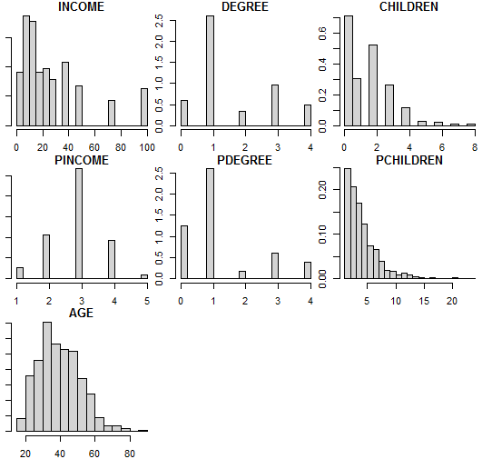
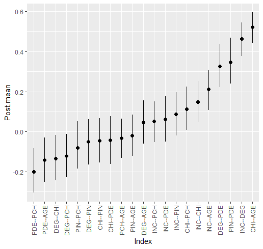
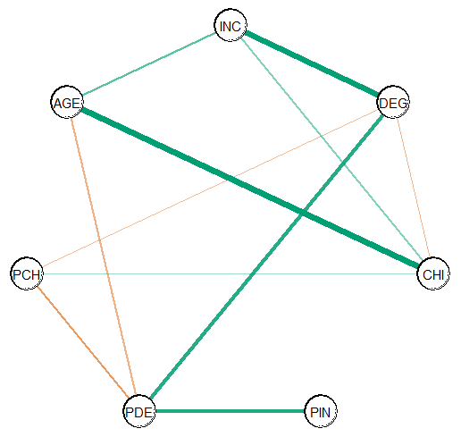

# Bayesian Gaussian Graphical Models

The `R` package **BGGM** provides tools for making Bayesian inference in
Gaussian graphical models (GGM, Williams and Mulder 2020). The methods
are organized around two general approaches for Bayesian inference: (1)
estimation and (2) hypothesis testing. The key distinction is that the
former focuses on either the posterior or posterior predictive
distribution (Gelman et al. 1996; see section 5 in Rubin 1984), whereas
the latter focuses on model comparison with the Bayes factor (Jeffreys
1961; Kass and Raftery 1995).

##  Installation

To install the latest release version (`2.1.6`) from CRAN use

``` R
install.packages("BGGM")
```

The current developmental version can be installed with

``` R
if (!requireNamespace("remotes")) { 
  install.packages("remotes")   
}   

remotes::install_github("rast-lab/BGGM")
```

###  Getting Help and Dealing with Errors

Check out the chatbot at [deepwiki](https://deepwiki.com/rast-lab/BGGM)
for an interactive way to get help on **BGGM**.

If you find bugs or are looking for additional features, open an
[issue](https://github.com/rast-lab/BGGM/issues) at the github
repository.

##  Overview

The methods in **BGGM** build upon existing algorithms that are
well-known in the literature. The central contribution of **BGGM** is to
extend those approaches:

1.  Bayesian estimation with the novel matrix-F prior distribution
    (Mulder and Pericchi 2018)

    - Estimation (Williams 2018)

2.  Bayesian hypothesis testing with the matrix-F prior distribution
    (Williams and Mulder 2019)

    - [Exploratory hypothesis
      testing](https://github.com/rast-lab/BGGM#Exploratory)

    - [Confirmatory hypothesis
      testing](https://github.com/rast-lab/BGGM#confirmatory)

3.  Comparing Gaussian graphical models (Williams 2018; Williams et al.

    2020. 

    - [Partial correlation
      differences](https://github.com/rast-lab/BGGM#partial-correlation-differences)

    - [Posterior predictive
      check](https://github.com/rast-lab/BGGM#posterior-predictive-check)

    - [Exploratory hypothesis
      testing](https://github.com/rast-lab/BGGM#exploratory-groups)

    - [Confirmatory hypothesis
      testing](https://github.com/rast-lab/BGGM#confirmatory-groups)

4.  Extending inference beyond the conditional (in)dependence structure
    (Williams 2018)

    - [Predictability](https://github.com/rast-lab/BGGM#predictability)

    - [Posterior uncertainty
      intervals](https://github.com/rast-lab/BGGM#posterior-uncertainty)
      for the partial correlations

    - [Custom Network
      Statistics](https://github.com/rast-lab/BGGM#custom-network-statistics)

The computationally intensive tasks are written in `c++` via the `R`
package **Rcpp** (Eddelbuettel et al. 2011) and the `c++` library
**Armadillo** (Sanderson and Curtin 2016). The Bayes factors are
computed with the `R` package **BFpack** (Mulder et al. 2019).
Furthermore, there are plotting functions for each method, control
variables can be included in the model (e.g., `~ gender`), and there is
support for missing values (see `bggm_missing`).

## Supported Data Types

- **Continuous**: The continuous method was described in Williams
  (2018). Note that this is based on the customary [Wishart
  distribution](https://en.wikipedia.org/wiki/Wishart_distribution).

- **Binary**: The binary method builds directly upon Talhouk et
  al. (2012) that, in turn, built upon the approaches of Lawrence et
  al. (2008) and Webb and Forster (2008) (to name a few).

- **Ordinal**: The ordinal methods require sampling thresholds. There
  are two approach included in **BGGM**. The customary approach
  described in Albert and Chib (1993) (the default) and the ‘Cowles’
  algorithm described in Cowles (1996).

- **Mixed**: The mixed data (a combination of discrete and continuous)
  method was introduced in Hoff (2007). This is a semi-parametric copula
  model (i.e., a copula GGM) based on the ranked likelihood. Note that
  this can be used for *only* ordinal data (not restricted to “mixed”
  data).

##  Illustrative Examples

There are several examples in the
[Vignettes](https://rast-lab.github.io/BGGM/articles/) section.

##  Basic Usage

It is common to have some combination of continuous and discrete (e.g.,
ordinal, binary, etc.) variables. **BGGM** (as of version `2.0.0`) can
readily be used for these kinds of data. In this example, a model is
fitted for the `gss` data in **BGGM**.

### Visualize

The data are first visualized with the **psych** package, which readily
shows the data are “mixed”.

``` R
# dev version
library(BGGM)
library(psych)

# data
Y <- gss

# histogram for each node
psych::multi.hist(Y, density = FALSE)
```



Posterior histogram

### Fit Model

A Gaussian copula graphical model is estimated as follows

``` R
fit <- estimate(Y, type = "mixed")
```

`type` can be `continuous`, `binary`, `ordinal`, or `mixed`. Note that
`type` is a misnomer, as the data can consist of *only* ordinal
variables (for example).

### Summarize Relations

The estimated relations are summarized with

``` R
summary(fit)

#> BGGM: Bayesian Gaussian Graphical Models 
#> --- 
#> Type: mixed 
#> Analytic: FALSE 
#> Formula:  
#> Posterior Samples: 5000 
#> Observations (n): 464  
#> Nodes (p): 7 
#> Relations: 21 
#> --- 
#> Call: 
#> estimate(Y = Y, type = "mixed")
#> --- 
#> Estimates:
#>  Relation Post.mean Post.sd Cred.lb Cred.ub
#>  INC--DEG     0.463   0.042   0.377   0.544
#>  INC--CHI     0.148   0.053   0.047   0.251
#>  DEG--CHI    -0.133   0.058  -0.244  -0.018
#>  INC--PIN     0.087   0.054  -0.019   0.196
#>  DEG--PIN    -0.050   0.058  -0.165   0.062
#>  CHI--PIN    -0.045   0.057  -0.155   0.067
#>  INC--PDE     0.061   0.057  -0.050   0.175
#>  DEG--PDE     0.326   0.056   0.221   0.438
#>  CHI--PDE    -0.043   0.062  -0.162   0.078
#>  PIN--PDE     0.345   0.059   0.239   0.468
#>  INC--PCH     0.052   0.052  -0.052   0.150
#>  DEG--PCH    -0.121   0.056  -0.228  -0.012
#>  CHI--PCH     0.113   0.056   0.007   0.224
#>  PIN--PCH    -0.080   0.059  -0.185   0.052
#>  PDE--PCH    -0.200   0.058  -0.305  -0.082
#>  INC--AGE     0.211   0.050   0.107   0.306
#>  DEG--AGE     0.046   0.055  -0.061   0.156
#>  CHI--AGE     0.522   0.039   0.442   0.594
#>  PIN--AGE    -0.020   0.054  -0.122   0.085
#>  PDE--AGE    -0.141   0.057  -0.251  -0.030
#>  PCH--AGE    -0.033   0.051  -0.132   0.063
#> --- 
```

The summary can also be plotted

``` R
plot(summary(fit))
```



Summary illustration

### Graph Selection

The graph is selected and plotted with

``` R
E <- select(fit)

plot(E, node_size = 12,
     edge_magnify = 5)
```



Nodes

The Bayes factor testing approach is readily implemented by changing
`estimate` to `explore`.

##  References

Albert, James H, and Siddhartha Chib. 1993. “Bayesian Analysis of Binary
and Polychotomous Response Data.” *Journal of the American Statistical
Association* 88 (422): 669–79.

Cowles, Mary Kathryn. 1996. “Accelerating Monte Carlo Markov Chain
Convergence for Cumulative-Link Generalized Linear Models.” *Statistics
and Computing* 6 (2): 101–11. <https://doi.org/10.1007/bf00162520>.

Eddelbuettel, Dirk, Romain François, J Allaire, et al. 2011. “Rcpp:
Seamless r and c++ Integration.” *Journal of Statistical Software* 40
(8): 1–18.

Gelman, Andrew, Xiao-Li Meng, and Hal Stern. 1996. “Posterior Predictive
Assessment of Model Fitness via Realized Discrepancies.” *Statistica
Sinica* 6 (4): 733–807.

Hoff, Peter D. 2007. “Extending the Rank Likelihood for Semiparametric
Copula Estimation.” *The Annals of Applied Statistics* 1 (1): 265–83.
<https://doi.org/10.1214/07-AOAS107>.

Jeffreys, Harold. 1961. *The theory of probability*. Oxford University
Press.

Kass, Robert E, and Adrian E Raftery. 1995. “Bayes Factors.” *Journal of
the American Statistical Association* 90 (430): 773–95.

Lawrence, Earl, Derek Bingham, Chuanhai Liu, and Vijayan N Nair. 2008.
“Bayesian Inference for Multivariate Ordinal Data Using Parameter
Expansion.” *Technometrics* 50 (2): 182–91.

Mulder, Joris, Xin Gu, Anton Olsson-Collentine, et al. 2019. “BFpack:
Flexible Bayes Factor Testing of Scientific Theories in r.” *arXiv
Preprint arXiv:1911.07728*.

Mulder, Joris, and Luis Pericchi. 2018. “The Matrix-F Prior for
Estimating and Testing Covariance Matrices.” *Bayesian Analysis*, no. 4:
1–22. <https://doi.org/10.1214/17-BA1092>.

Rubin, Donald B. 1984. “Bayesianly Justifiable and Relevant Frequency
Calculations for the Applied Statistician.” *The Annals of Statistics*,
1151–72. <https://doi.org/10.1214/aos/1176346785>.

Sanderson, Conrad, and Ryan Curtin. 2016. “Armadillo: A Template-Based
c++ Library for Linear Algebra.” *Journal of Open Source Software* 1
(2): 26. <https://doi.org/10.21105/joss.00026>.

Talhouk, Aline, Arnaud Doucet, and Kevin Murphy. 2012. “Efficient
Bayesian Inference for Multivariate Probit Models with Sparse Inverse
Correlation Matrices.” *Journal of Computational and Graphical
Statistics* 21 (3): 739–57.

Webb, Emily L, and Jonathan J Forster. 2008. “Bayesian Model
Determination for Multivariate Ordinal and Binary Data.” *Computational
Statistics & Data Analysis* 52 (5): 2632–49.
<https://doi.org/10.1016/j.csda.2007.09.008>.

Williams, Donald R. 2018. “Bayesian Estimation for Gaussian Graphical
Models: Structure Learning, Predictability, and Network Comparisons.”
*arXiv*, ahead of print. <https://doi.org/10.31234/OSF.IO/X8DPR>.

Williams, Donald R, and Joris Mulder. 2019. “Bayesian Hypothesis Testing
for Gaussian Graphical Models: Conditional Independence and Order
Constraints.” *PsyArXiv*, ahead of print.
<https://doi.org/10.31234/osf.io/ypxd8>.

Williams, Donald R, and Joris Mulder. 2020. “BGGM: Bayesian Gaussian
Graphical Models in r.” *PsyArXiv*.

Williams, Donald R, Philippe Rast, Luis R Pericchi, and Joris Mulder.
2020. “Comparing Gaussian Graphical Models with the Posterior Predictive
Distribution and Bayesian Model Selection.” *Psychological Methods*,
ahead of print. <https://doi.org/10.1037/met0000254>.
